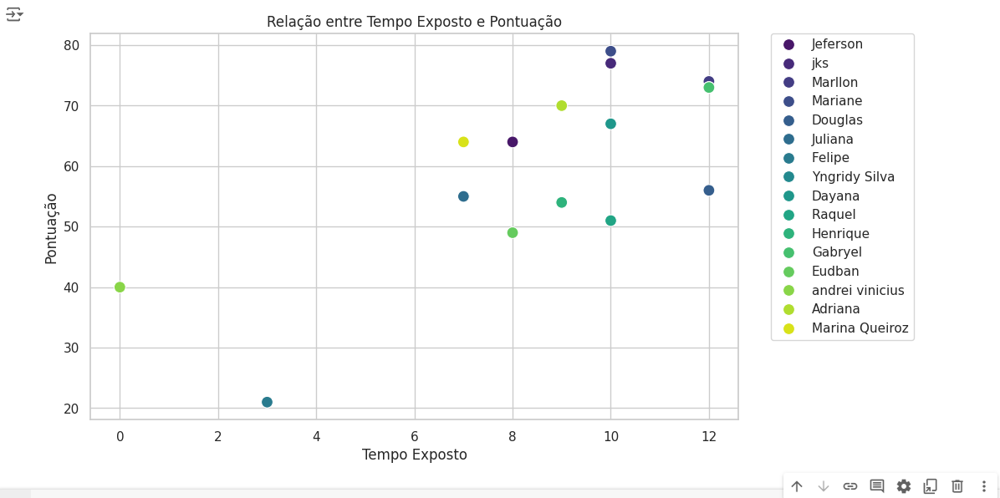

# PyEye

Finalidade desse projeto é gerar um score que fornece detalhes sobre uso de telas do usuario, enquanto coleta dados que serão usados para futuras análises preditivas de comportamento em frente a telas.

<br/>

## Analise de dados já coletados




<br/>
## 🔎 Status do Projeto

Se você ainda não enviou seus dados para obter seu score o que esta esperando?
Acesse agora mesmo e confira sua score: [https://pyeye.ddnsgeek.com/]

<br/>

## 🛠️ Setup projeto

Este projeto foi concebido com uma arquitetura de microserviços, visando uma estrutura modular e escalável. A conexão entre o frontend e o backend é estabelecida de forma eficiente, garantindo uma comunicação fluida e rápida.

A interface web foi construída utilizando a tecnologia React, proporcionando uma experiência de usuário moderna e responsiva. Essa interface é responsável por enviar dados para a API, que por sua vez, foi desenvolvida com o framework FastAPI em Python usando arquitetura MVC.

### Tecnologias principais
- React: Responsável pela construção da interface web, garantindo uma experiência de usuário moderna e interativa.
- FastAPI: Framework utilizado no backend, implementado em Python, oferecendo uma solução eficiente e rápida para o desenvolvimento de APIs.
- Docker: Empregado para assegurar a consistência do ambiente de desenvolvimento e produção, facilitando a implantação e a escalabilidade do sistema.
- PostgreSQL: Banco de dados relacional utilizado para armazenar os dados do projeto, garantindo segurança, confiabilidade e integridade dos dados.


## ⏳ Executando o projeto
O projeto está dockerizado, facilitando a configuração do ambiente. Para iniciar, basta executar o seguinte passos abaixo:
- 1: Certifique-se de ter o Docker instalado em sua máquina.
- 2: Abra o terminal ou prompt de comando na pasta raiz do projeto.
- 3: Execute o seguinte comando para iniciar o projeto
- 4: Para uso sem PostgreSQL basta apenas comentar a linha 14 e descomentar a linha 16 dentro de app/backend/database/connection.py

```docker-compose up --build```

## 📡 Tecnologias utilizadas
<div align="center">


</div>

